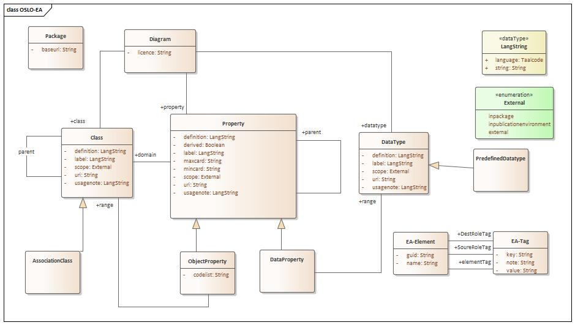
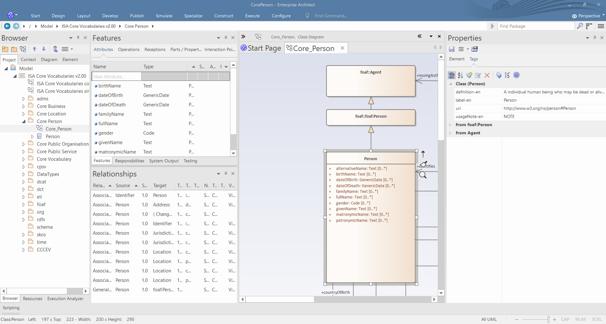

# Modeling data specifications

This chapter decribes the key notions and information an editor need to understand for modeling data specifications.
Within this document the term data specification is to refer to its core: the semantical model, i.e. the classes and properties with their semantic description.
Besides this, and beyond the scope of this chapter, a data specification contains metadata about the document, a changelog, use case descriptions, context, conformance statements and more.

First differences between the 


## Data specification categories

Designing a data specification encompasses the following activities:
- determining the appropriate data structures (Class, Property, ...)
- for each entity the necessary semantical information to relate it to the real world phenonomen it describes.

Data specifications can roughly be categorized in three categories according to their intend of reuse.

A *vocabulary* is a collection of terms.  
A term is consists minimally of a label and definition and is identified with a URI. 
The information attached to a term in a vocabulary is expressed with the intend to be applicable within a broad context. 
Guidelines on writing good definitions can be found (here)[].
 
An *application profile* is the usage of terms with an generic application context. 
The application context imposes additional constraints on the usage of the terms such as cardinalities, ranges, codelists, ...
This usage context may also introduce alternative labels or more specific definitions for reused vocabulary terms. 
Editors of application profiles have the challenge to find the balance between introducing new terms and reusing existing terms. 

Application profiles can be further elaborated to the point they describe the usage of the terms in an operational environment (software solution). 
These are called *implementation models*.


Aside the differences in the content resulting from the reuse perspective, each category has different expectations on the representation and published artefacts. 
The listed expectations result from the premisse to use the _Semantic Web_ as __basis__ for the design of the data specification.

Vocabularies expect 

  - a document with a simple tabular view of the terms 
  - dereferenceable persistent identifiers (PURIs)

Application profiles expect

  - a document 
    - explaining the application scope 
    - providing a visual overview of the data model
    - a textual, tabular representation expressing the data model entities
  - supportive assets for implementers such as
    - shacl templates
    - json-ld context files
    - xsd schemas
    - examples
  - and being integrated with the vocabularies it reuses

Implementation models expect

  - the same as application profiles, but usually augmented with additional specific artefacts for that system. 
      E.g. a template DB, an API specification, ...


Observe that application profile design is always connected with the creation of a vocabulary associated with application context. 
It is very unlikely that an application profile is only reusing terms from existing vocabularies. 
Therefore creating and supporting application profiles means also creating and supporting vocabularies, in order to achieve the objectives. 


The SEMIC Core Vocabularies have the design intend of the vocabularies category: namely broad reuse mostly ignorant about the application context.
But over the years the SEMIC community has requested support towards the *application* of the Core Vocabularies. 
Therefore aspects of what are considered above *application profile* expectations are provided into the Core Vocabularies. 
The provided artefacts can thus be seen as (a small) step in the process of incorporating the core vocabulary in a usage context. 
For instance, the SHACL shape for a Core Vocabulary is very permissive as it soley expresses that the range of a property might be of an expected broad type (e.g. Literal versus Resource). 

The Core Vocabularies are showing that the boundaries between a vocabulary and an application profile, as defined above, are not precisely determined.
Vocabularies, application profiles and implementation models are entities on an axe of reusability/application context.
Vocabularies are collections of terms formulated in such a way that they are reusable to a maximum extend without becoming semantically too vague/abstract.
Application profiles are other collections of the same terms but then within a more specific, but still generic  application context. 
And on the other far extreme are the collection of terms used within a very specific context: implementation models.

Despite at this moment no formal expectation of the SEMIC data specifications has been written out, the editors' awareness of this categorisation will aid the semantical model creation.


# UML model 

As mentioned in the previous section, a SEMIC data specification is build and published according to the best practices of the Semantic Web.
Following this approach data specifications identifiy terms with URIs and associate the term with the real world using associated semantic information expressed as human readible expressions (labels, definitions, usage notes, ...) and formal logic statements (subclass, domain, range, cardinalities, ...). 

However because the Semantic Web representations (tables in html or machine readible, i.e. RDF) are not providing consumers a satisfactory way for understanding the data specification, often a graphical representation is provided.
Graphical representations are able to convey more condensly the key formal logic statements at one glance.
Instead of reinventing a new graphical language, SEMIC uses UML as graphical modelling language.

This introduces the challenge of maintaining the coherency between the Semantic Web representation, i.e. RDF, and the UML representation. 
The [toolchain](./toolchain.md) deployed by SEMIC implements the following master data management.

(transformation argument)
For coherency accross all specifications it is easier to transform a UML diagram to a semantic representation, than transforming an semantic representation in a UML notation. 
Turning RDF vocabularies into UML fully exploiting the graphical notation possibilies would require to create a new configuration language.
This language would not only include semantical instructions (for instance this URI is a UML class), but quickly also include styling and other represenation instructions. 
A large part of the editorial effort for a graphical representation is organising and styling the picture to make it as supportive as possible for the consumers. 
That is a complex task.
It is far more easier to exploit the power of a UML modeling tool, offering all the graphical styling possibilities an editor needs, and transform the resulting UML representation.

(editorial argument)
When interacting with the Working Group the discussion is often driven by a graphical representation.
Therefore editors naturally first create the graphical representation of the proposed resolution.
When agreement is reached, the decision is turned into the data specification following the Semantic Web principles by the editor.

Both arguments resulted in the design decision to store the master data of the data specification in a UML model.
However despite the UML diagram will act as the master data for the data specification, it is the semantical model that is generated from it which the consumers will consider as the data specification.

----

>
> And therefore existing RDF vocabulary visualisations offer not a mapping to the specific UML language but an ability to graphically browse the RDF vocabulary graph which the user of the visualisation can style and organise themselves. 
> These visualisation therefore are not intented to explore the semantics behind the 
>
> Creating an managing data specification acording to the Semantic Web principles is not a default course for students. 
> UML modeling is however part of most curicula.
> Therefore editors are more trained in modeling UML than modeling Semantic Web. 
>

----

## Extracting the semantical model from the UML model

In the toolchain the creation of the data specification is a roughly a two phase process: first all information of the data specification is collected in an internal representation. And subsequently from that internal representation are the to be published artefacts of the data specification generated.
The internal representation is the same for each category of data specifications. 

In this section the core activity of the first phase, namely extracting the semantical model in this internal representation expressed in the UML diagram.


Within the toolchain the [Enterprise Architect Conversion Tool](https://github.com/Informatievlaanderen/OSLO-EA-to-RDF) is used to convert a UML diagram into the internal representation.
At the moment the sole supported input file format is an EAP file, the format by the UML editor Enterprise Architect.
This is not a limitation for SEMIC as all data specifications are modeled in Enterprise Architect.


The connection between the UML graphical language and Semantic Web is based on interpreting the UML language and additional annotations provided by the editors.
These annotations are key because they control 
  - the URI assignment
  - the human readible semantics
This information is not part of the _standard_ UML. 

Beyond the supporting the interpretation of the UML diagram, the Enterprise Architect Convertion tool supports annotations to facilitate the control of the scope of the content of the semantic model.

An graphical overview of the content of extracted information is shown below.



Each attribute corresponds with an annotation.


### EA data model tags
In Enterprise Architect these annotations are expressed as tags.
The tags have the following representation

```
   {documenttype}-{annotation}-{language}
```

The {documenttype} can be 
   - **empty**:  corresponds with the vocabulary interpretation. The base information about the term.
   - **ap**: application profile (ap) 

The {language} corresponds to the 2-letter code for a language in which the content of the annotation is expressed.

Examples:
  - `label-nl`: the tag expresses the label of the term in Dutch at the level of a vocabulary. 
  - `ap-usageNote-en`: the tag expresses the usage note in English for the application profile

The pattern is very useful as it allows to have two perspectives on the same term in the UML file.
One perspective is the base reference: the vocabulary, and the other perspective is the application usage context.
Having the ability to have them side by side make it is much easier for editors to ensure the reuse of a term is done properly.

Not all annotations support a prefix {documenttype} or suffix {language}. 
For instance: `uri` has no prefix or suffix as a term should have only one globally unique persistent identifier. 


### Example
To use the [toolchain](./toolchain.md), editors are required to edit the EAP file of the data specification. 
The following screenshot shows the class _Person_ in Enterprise Architect. 



In the middle the UML graphical representation is shown. On the right hand side the tags for the selected class _Person_.
Right from the graphical representation the attributes and relationships of the class are shown.


