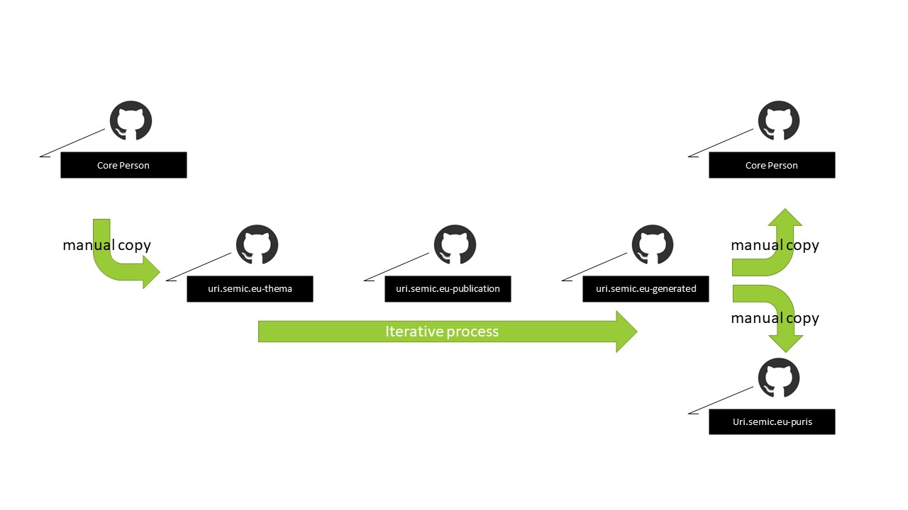

# Editorial flow

An editorial flow is initiated when issues for a data specification are to be adressed.
This section provides a high level overview how the editor will interact with the SEMIC GitHub space to execute this task.

First the editorial flow is described generically, at design level. 
The generic flow is then made more concrete with an example.

# Generic editorial flow


The editorial flow consist of 6 steps:

1. Find the latest UML master data.

   The editor selects the data specification GitHub repository that contains the latest published artefacts to determine the source information.
   From that repository the UML file is copied to the uri.semic.eu-thema repository.


2. Edit the UML file in [uri.semic.eu-thema]

   The editor opens and edits the UML file in the appropriate UML editor. 
   Then the UML structure is adapted to resolve the issue. 
   The UML structure is changed according to the [toolchain UML data model requirements](./datamodel.md). 

   The changed UML file is committed in the uri.semic.eu-thema repository.

3. Trigger the toolchain

   The editor triggers the rendering of the data specification artefacts by adding a publication point in the [publication reposiory](https://github.com/SEMICeu/uri.semic.eu-publication).

4. Check the generated artefacts

   When the toolchain processing is finished the artefacts are available in the [generated repository](https://github.com/SEMICeu/uri.semic.eu-generated).

   If the artefacts address the issue as expected the editor continues with the publication (step 5), otherwise another iteration is required (back to step 2 ).

5. Publish the generated artefacts 


   To provide the consumers access to the updated artefacts, the editor must publish the generated artefacts to the right places by copying the content to other GitHub repositories.
   
   This consists of copying artefacts to the data specification repository from where the editorial flow was started. 
   This must be done in accordance with the guidelines on these data specification repositories, for instance by creating a new release directory.

   Another repository might be affected to: namely when the edit resulted in a RDF content change for a persistent URI.
   Then the RDF artefact data has to changed according to the steps documented in [uri.semic.eu-puris](https://github.com/SEMICeu/uri.semic.eu-puris).

6. Verify the published artefacts 

   To finalise the editorial flow a final verifaction of the published data specification is adviced.
   The editor will then take the role of the consumer to investigate if the new situation is as desired.


## NOTE: generation and publication require manual effort

The workflow above shows that the artefact generation tooling (the toolchain) does not releaves editors from substantial manual work.
This manual work happens at the start of the editorial flow and at the end.
In both cases the work introduces risks for unnoticed changes or incomplete publications.

To reduce these risks additional work has to be done to further integrate the artefact generation into the data specification repositories and vice versa.
This is feasible, but probably will require further alignment and restructuring of the data specification repositories in the SEMIC GitHub space.
Topics like version numbering, using shared PURI domain, etc. are affecting the automation.


# Example editorial flow

To illustrate the generic editorial flow consider the common change request to add a property to a class in a data specification.


Let's make the example more concrete: add the property "baptismal name" to the class Person in Core Person Vocabulary and publish this new data specification as _version 2.0.1-Example_.



For readibility the figures are placed below.


1. Find the latest UML master data.

    In the [Core Person Vocabulary](https://github.com/SEMICeu/Core-Person-Vocabulary/tree/master/releases/2.00/uml) repository the latest published UML file is located.
    Copy this version to the [uri.semic.eu-thema](https://github.com/SEMICeu/uri.semic.eu-thema) for editing.
    

2. Edit the UML file in [uri.semic.eu-thema](https://github.com/SEMICeu/uri.semic.eu-thema)

   The editor edits the copy and adds the property with the required annotations. 
   Figure [1](#figure1) shows the property 'baptismalName' with the label in English, definition and the assigned URI. 
   After finishing the editing, the editor commits the UML file. 
   Let 'ad345' the hash identifying this commit.
   
3. Trigger the toolchain

   The editor creates a new publication point
   ```
      {
        "urlref": "/doc/core-vocabulary/core-person/2.0.1-Examples",
        "repository": "git@uri.semic.eu-thema:SEMICeu/uri.semic.eu-thema.git",
        "branchtag": "ad345",
        "name": "core-person-ap",
        "filename": "config/core-person.json",
        "navigation": {}
      },
   ```
   indicating the creation of the artefacts for the Core Person Core vocabulary stored in the uri.semic.eu-thema repository identified by the commit hash.
   The result is stored in the uri.semic-eu-generated repository in the directory `/doc/core-vocabulary/core-person/2.0.1-Examples`.

   By committing this publication point, done by updating the file [publication.json](https://github.com/SEMICeu/uri.semic.eu-publication/blob/master/config/dev/publication.json), the processing is triggered.
   
4. Check the generated artefacts

   When the artefact generation processs is finished, the generated artefacts are available in the generated repository.
   More specifically in the directory `/doc/core-vocabulary/core-person/2.0.1-Examples`.

   The editor downloads the artefacts and checks if the generated artefacts contain the new property. 
   Suppose a typo is detected in the definition then the editor will return to step 2: the editor will update the UML file, change the `branchtag` in the publication point to the commit hash that corresponds to this update and then will trigger the generation again.

   Througout this iterative process the editor constructs the artefacts that are ready for publication.


5. Publish the generated artefacts 

   To share the new artefacts with the public the editor follows the publication guidelines for Core Person repository.

   First, a directory `2.0.1-Example` is created in the Core Person Vocabulary repository in the releases directory.
   Because the editor must ensure that no information of the previous release of the Core Person Vocabulary is lost in the new release, it is advised to initiated the content of that directory with the content of the previous release.
   Then the artefacts from the generated repository in the directory `/doc/core-vocabulary/core-person/2.0.1-Examples` are copied into this directory.
   Committing this will make the content available to the public.
   
   Since the `baptismal name` is a new property and thus got a new PURI assigned, the editor has to publish the content in the repository uri.semic.eu-puris.
   Extract from the generated RDF artefact the triples that are relating to the new property, and store these in a file with the name 'baptimalName'. 
   Create a variant for the RDF serialization ntriples, turtle, and RDF/XML with the approporiate file extension.
   Commit these files in the directory `releases/m8g`.

   

6. Verify the published artefacts 
    
   All the steps above result in the page  `https://semiceu.github.io/CCCEV/releases/2.0.1-Examples/`. 
   This is public URL for the html representation of the Core Vocabulary. 
   On this page the data specification is described and all artefacts and contextual information can be found.
   By doing a final check of this URL, the editor ensures quality of work.
   
    
    
