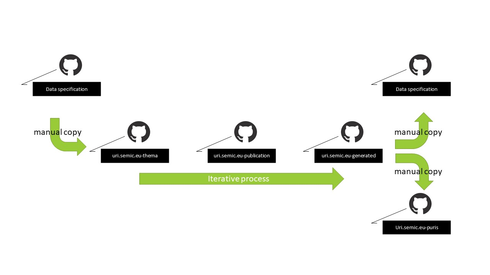

# Editorial flow

An editorial flow is initiated when issues for a data specification are to be addressed.
This section provides a high level overview on how the editor will interact with the SEMIC GitHub space to execute this task.

First, the editorial flow is described generically, at design level. 
Next, the generic editorial flow is made more concrete with an example.
To make the example more insightful, it is composed of three short screen recordings each illustrating some steps.

# Generic editorial flow

The editorial flow consist of 6 steps:

1. Find the latest UML master data.

   The editor selects the data specification GitHub repository that contains the latest published artefacts to determine the source information.
   From that repository the UML file is copied to the uri.semic.eu-thema repository.

2. Edit the UML file 

   The editor opens and edits the UML file in the appropriate UML editor. 
   The UML structure is modified to address the issue.
   These changes are made according to the [toolchain UML data model requirements](./datamodel.md). 

   The changed UML file is committed in the [thema repository](https://github.com/SEMICeu/uri.semic.eu-thema).

3. Trigger the toolchain in the publication repository.

   The editor triggers the rendering of the data specification artefacts by adding a publication point in the [publication repository](https://github.com/SEMICeu/uri.semic.eu-publication).
   For more information on how this is done, please check out the section on [How to trigger the generation of the artefacts](./toolchain.md#howto-trigger-the-generation-of-the-artefacts).  

4. Check the generated artefacts

   When the toolchain processing is finished the artefacts are available in the [generated repository](https://github.com/SEMICeu/uri.semic.eu-generated).

   If the artefacts address the issue as expected the editor continues with the publication (step 5), otherwise another iteration is required (back to step 2 ).

5. Publish the generated artefacts.

   To provide the consumers access to the updated artefacts, the editor must publish the generated artefacts to the right places by copying the content to other GitHub repositories.
   
   This consists of copying artefacts to the data specification repository from where the editorial flow was started. 
   This must be done in accordance with the guidelines on these data specification repositories, for instance by creating a new release directory.

   Another repository might be affected too; namely, when the editing resulted in an RDF content change for a persistent URI published by SEMIC.
   If this is the case, the change must be propagated to the PURI content repository [uri.semic.eu-puris](https://github.com/SEMICeu/uri.semic.eu-puris) as well.
   

6. Verify the published artefacts.

   To finalise the editorial flow a final verification of the published data specification is advised.
   The editor will then take the role of the consumer to investigate if the new situation is as desired.

## NOTE: The Generation and publication of artefacts require manual effort

The workflow above shows that the artefact generation tooling (the toolchain) does not releases editors from substantial manual work.
This manual work happens at the start of the editorial flow and at the end.
In both cases the work introduces risks for unnoticed changes or incomplete publications.

To reduce these risks additional work has to be done to further integrate the artefact generation into the data specification repositories and vice versa.
This is feasible, but probably will require further alignment and restructuring of the data specification repositories in the SEMIC GitHub space.
Topics like version numbering, using shared PURI domain, etc. are affecting the automation.

# Example editorial flow

To illustrate the generic editorial flow consider the common change request to add a property to a class in a data specification. 

The text below is summarised transcript of a video recording demonstrating the addition of a new property 'baptismal name' to the class Person in the Core Person Vocabulary.
The video recordings are:
 
   - [Part 1](https://github.com/SEMICeu/documentation/blob/main/images/step1.mp4?raw=true) - demonstrates the editing of the UML model
   - [Part 2](https://github.com/SEMICeu/documentation/blob/main/images/step2.mp4?raw=true) - demonstrates the automated generation of the data specification artefacts
   - [Part 3](https://github.com/SEMICeu/documentation/blob/main/images/step3.mp4?raw=true) - demonstrates the (manual) publication step

All demonstrated changes are performed on the involved repositories using a demonstration branch called `example`.
Using this branch all activities can demonstrated on a working environment, except for the last step: the official publication of the transformation.

*Note*: The recording applies one way to interact with the repositories. 
This approach has been selected to facilitate the recording, not because is the most efficient or best way to interact with the SEMIC GitHub space.
Editors can use their preferred way to interact with the SEMIC GitHub space, e.g. checking out the code and working locally, then pushing the changes back.

## Part 1: Change the UML model ( [video](https://github.com/SEMICeu/documentation/blob/main/images/step1.mp4?raw=true) )

1. Find the latest UML master data.

    In the [Core Person Vocabulary](https://github.com/SEMICeu/Core-Person-Vocabulary/tree/master/releases/2.00/uml) repository the latest published UML file is located.
    Copy this version to the [uri.semic.eu-thema](https://github.com/SEMICeu/uri.semic.eu-thema) for editing.
    

2. Edit the UML file in [uri.semic.eu-thema](https://github.com/SEMICeu/uri.semic.eu-thema)

   The editor edits the copy, and adds the property 'baptismalName' with the annotations: the label and definition in English, and the assigned URI.
   After finishing the editing, the editor commits the UML file to the thema repository.
   
## Part 2: Build the artefacts using the toolchain ( [video](https://github.com/SEMICeu/documentation/blob/main/images/step2.mp4?raw=true) )

3. Trigger the toolchain 

   The editor selects the commit hash corresponding to the UML file update in the thema repository. 
   Using this commit hash, the [publication points](https://github.com/SEMICeu/uri.semic.eu-publication/blob/example/config/dev/publication.json) in the publication repository are updated. 
   In the demonstration video, the `branchtag` attribute of the publication points are updated with the new commit hash.
   This change will trigger the artefact generation process.
   The progress of the generation process can be followed in [CircleCI](http://circleci.com).

## Part 3: Publish the result ( [video](https://github.com/SEMICeu/documentation/blob/main/images/step3.mp4?raw=true) )

4. Check the generated artefacts

   When the artefact generation process is finished, the generated artefacts are available in the generated repository.
   In the demonstration video, the updated artefacts are found within the directory [`/doc`](https://github.com/SEMICeu/uri.semic.eu-generated/tree/example/doc). 

   To prepare the next step, the editor checks the generated artefacts to see whether the result is correct: e.g. if the property is present in all relevant artefacts.
   There are several ways to check this: the editor can download the artefacts and checks within the downloaded files for the new property, but he or she can also use the GitHub built in diffing support.

5. Publish the generated artefacts 

   *Note:* This and the subsequent step are only partially shown in the recording. 
   In order to demonstrate all the steps, it would require to propagate the demonstration content to the consumers on an official channel.
   Therefore, only the changes that do not lead to immediate and direct impact on the consumers are included in the video.

   **Not in the recording:** To share the new artefacts with the public, the editor follows the publication guidelines for Core Person repository. 
   For that, the editor will use the version (release number) of the data specification.
   First, a directory named after the version is created in the Core Person Vocabulary repository, under the `releases` directory.
   Because the editor must ensure that no information contained in the previous release of the Core Person Vocabulary is lost in the new release, it is advised to initiated the content of the new directory with the content of the previous release.
   Then the artefacts from the generated repository in the directory `/doc/core-vocabulary/core-person/` are copied into this directory.
   Committing this will make the content available to the public.

   **In the recording:** Since the `baptismal name` is a new property, and thus got a new PURI assigned, the editor has to publish the content in the PURIS content repository [uri.semic.eu-puris](https://github.com/SEMICeu/uri.semic.eu-puris). 
   The editor extracts from the generated RDF artefact the triples that are relating to the new property, and stores these in a file with the name 'baptismalName'. 
   A variant for the RDF serialisation ntriples, turtle, and RDF/XML, with the corresponding file extensions, is then created, using one of the many RDF serialisation tools. In the video an online web tool is used.
   The editor will commit these files in the directory `releases/m8g` in the PURIs content repository *uri.semic.eu-puris*.
   For demonstration purposes the file created during the video are stored in the branch `example`, e.g. [baptismalName.ttl](https://github.com/SEMICeu/uri.semic.eu-puris/blob/example/releases/m8g/baptismalName.ttl).
   

   

6. Verify the published artefacts 
    
   **(not in the recording)** All the steps above result in the page  `https://semiceu.github.io/Core-Person-Vocabulary/releases/{version}/` (e.g. https://semiceu.github.io/Core-Person-Vocabulary/releases/2.00/). 
   This is the public URL for the HTML representation of the Core Vocabulary. 
   On this page the data specification is described, and all artefacts and contextual information can be found.
   By doing a final check of this URL, the editor ensures quality of work.
   
    
    
