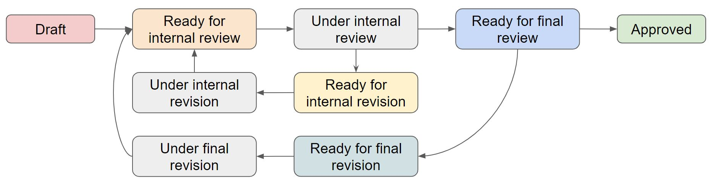

# Progress 

## Table of Contents

 - README : overview of the toolchain documentation + SEMIC repository space organisation 
 - actors : key actors and their prerequisites
 - editorial flow : the flow of activities an editor performs
 - datamodel : notions and considerations on data specifications
 - toolchain : technological setup and organisation to support the editorial flow
 - puri : persistent identifiers
 - data specifications actefacts:
 - xsd : the xsd artefact
 - glossary 

## Planning

| Page | Status| Planned date for 'Ready for internal review' | Planned date for 'Ready for final review' | Planned date for  'Approved' |
| ---- | ---- | ---- | ---- | ---- | 
| README.md | Under internal revision (2nd round) | 7 june 2022 | 9 june 2022 | |
| actors.md | Under internal revision (2nd round) | 7 june 2022 | 9 june 2022 | |
| editorial_flow.md | Draft | 8 june 2022 | 10 june 2022 | |
| datamodel.md | Ready for internal revision |  8 june 2022 | 10 june 2022 | |
| toolchain.md | Under internal revision |  8 june 2022 | 10 june 2022 | |
| puri.md | Ready for internal review | 8 june 2022 | 10 june 2022 | |
| artefact_generation.md | Draft | 9 june 2022 | | |
| xsd.md | Draft  | 9 june 2022 | |
| glossary.md | Draft | |

**Legend for status:**

 - **Draft** : text in flux (major changes to be expected)
 - **Ready for internal review** : text is stable and requires internal quality check
 - **Under internal review** : undergoing internal review
 - **Ready for internal revision** : internal review is finished, suggestions for further improvements have been made, which need to be addressed
 - **Under internal revision** : undergoing changes to address feedback from internal review
 - **Ready for final review** : text and structure is in publishable shape, ready to undergo an official review
 - **Ready for final revision** : official review is finished, suggestions for further improvements have been made, which need to be addressed
 - **Under final revision** : undergoing a final "official" review
 - **Approved** : text has been accepted for publishing

