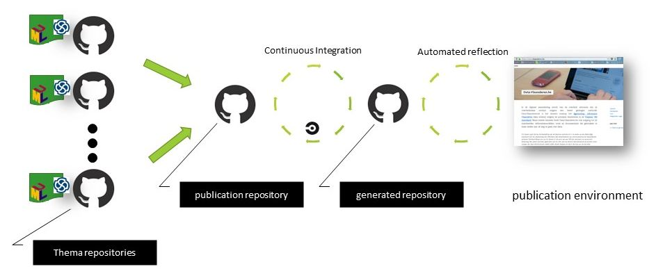

# Toolchain for publishing data specifications


## Motivation

To support the editors in creating and maintaining data specifications in a coherent manner, tooling is required.

Data specifications have their own life cycle. 
The various Core Vocabularies are created by different (editorial) teams, with different Working Groups, at different times.
In the past, the manual editing has resulted in similar, yet distinct, and sometimes incoherent, expressions of these Core Vocabularies.
A situation that raised many questions by the consumers.

To have the data specifications progress in the same way, and following the same style, tooling support is required. 
Introducing tooling will force the editors to follow a predefined editorial flow, and thus reduce their editorial freedom to the limits of the tooling.
This limitation, however, brings crucial benefits for the SEMIC project; namely, it will:
  - provide a harmonised, coherent experience of the data specifications. This will increase the adoption by the consumers.
  - allow the embedding of the key SEMIC data modeling in formal processes, instead of relying solely on the experience of the editors.
  - support scaling up the editorial capacity. Automation provides the ability to learn the editorial flow in a safe environment.


This chapter describes the tooling that is supporting the editorial flow for managing data specifications.
It focusses on the interplay between the different repositories, and how editors can use it to generate the data specification artefacts.
First the design and how it is setup in SEMIC space is described.
Then frequently asked questions by the editors and developers are answered.
The artefact generation itself is documented in the chapter on [artefact generation](./artefact_generation.md).


## Setup & Design


The toolchain used in the SEMICeu project is based on the [OSLO toolchain](https://github.com/Informatievlaanderen/OSLO-toolchain/tree/master/doc-generic).

The OSLO toolchain is part of a larger environment for supporting the generation, maintenance and publication of data specifications under the governance of the Flemish Government, Belgium.
Because OSLO has been participating in SEMIC from the start, the toolchain incorporates many advices and best practices SEMIC has produced or applies.
This is especially true for the support of the editorial flow. 
The main distinction situates at the publication approach: the current SEMIC practice is to use github as publication platform where per data specification a repository is created, while the OSLO toolchain has been designed with a single publication environment in mind.

In the [editorial flow](./editorial_flow.md) this distinction is visible in the manual publication steps the editor has to perform; steps that are not required in the OSLO context. This is future work to adapt the tooling to the SEMIC publication context.

The result from the OSLO toolchain can be seen at [data.vlaanderen.be](https://data.vlaanderen.be).
Tooling source code and data specifications are all publicly available on [GitHub](https://github.com/search?q=org%3AInformatievlaanderen+topic%3Aoslo).


### Generic Design

The high level design OSLO toolchain is illustrated in the figure below.



The objective is to automate the publication of the data specifications on a publication environment.
A _publication environment_ is a website identified by a domain. 
The content of that website can be (and usually is) broader than the data specifications, but the toolchain is solely concerned with the publication of the data specifications.
The toolchain is designed to create a static website, i.e. a collection of webpages.
This design choice simplifies the operational work to serve the data specifications on the publication environment, but also more importantly it provides the editors with a exact view on what is being shared with the consumers on the publication environment.

The source code of the static website, i.e. the publication environment, is stored on GitHub in the _publication repository_.
The result of the generation process, i.e. the static website, is stored in the _generated repository_. 
A _publication_ repository is thus always paired with a _generated_ repository. 
The generated repository is kept in sync with the publication repository via a [Continous Integration/Continuous Development](https://en.wikipedia.org/wiki/CI/CD) (CI/CD) execution flow. 
Within software engineering CI/CD is the name for any automated process supporting the software building and deployment activities.
Each change (commit) to the publication repository will after a successful CI/CD execution lead to a change in the generated repository.

Using the branching functionality of Github repositories, system staging, i.e. publishing on development, testing and production publication environments, is supported. 


To provide the editorial freedom to let data specifications have their own life cycle, the source of a data specification is stored in their own repository. 
These repositories are called _thema repositories_. 
The publication repository contains a list of references to the thema repositories.
More precisely those are references to unique points in time, i.e. commits.
These references are called __publication points__.
Editors primarely interact with thema repositories, only when a new publication of the data specification is required they update the publication repository with a new publication point.
This setup creates flexibility and provides editorial scaling potential, without loosing a central control. 


For more information on the OSLO toolchain tools, the OSLO maintainers can be contacted. 
This can be via posting a github issue or via email on digitaal.vlaanderen@vlaanderen.be.

The deployment of the above design is supported with two template repositories.
 - _template for a publication repository_ [https://github.com/Informatievlaanderen/OSLO-publicationenvironment-template](https://github.com/Informatievlaanderen/OSLO-publicationenvironment-template).
 - _template for a thema repository_ [https://github.com/Informatievlaanderen/OSLOthema-template](https://github.com/Informatievlaanderen/OSLOthema-template)

The generated repository does not require a template.

After creating the publication repository from the template the publication repository must be paired with the generated repository. 
Documentation how to this and more configuration options are found in the documentation that is part from of the template.


### SEMIC setup

In contrast to the OSLO toolchain premisse of a single publication environment, i.e. a single website, SEMIC has decided to apply a decentralised publication strategy. 
Each data specification repository in the SEMICeu space is not only the source of the specification, but also the publication platform for that data specification by using GitHub pages service offering. 

The OSLO toolchain separates these functionalities (master data source, content generation, publication) in seperated repositories, making it then natural to combine the processing of multiple data specifications in one pair publication and generated repository.
Instead of applying the OSLO toolchain setup to each SEMICeu data specification, the toolchain has been deployed in the assumption there is one SEMIC publication environment despite this technically is not the case.
This deployment corresponds to a minimalistic setup providing already the most important editorial support for creating harmonised artefacts for all data specifications.

In the SEMICeu GitHub space the toolchain has been deployed in these repositories:

- [https://github.com/SEMICeu/uri.semic.eu-publication](https://github.com/SEMICeu/uri.semic.eu-publication) - the _publication_ repository
- [https://github.com/SEMICeu/uri.semic.eu-generated](https://github.com/SEMICeu/uri.semic.eu-generated) - the _generated_ repository
- [https://github.com/SEMICeu/uri.semic.eu-thema](https://github.com/SEMICeu/uri.semic.eu-thema) - a _thema_ repository that currently contains _all_ the SEMIC data specifications. This choice can be revisited in the future.
All editing happens on the _master_ branch as there are no staging publication environments.


Within the SEMICeu GitHub space, these repositories are **private** GitHub repositories. 
This influences the execution and configuration as operating on private repositories is a differrent GitHub API request than those which can be used for public GitHub repositories.
More information this and the configuration can be found in the [publication environment documentation](https://github.com/SEMICeu/uri.semic.eu-publication/blob/master/config/README.md).

How these repositories feature in the management of data specifications is elaborated in the [editorial flow](./editorial_flow.md).

This setup does not provide the end-to-end experience of the original design, but it is feasible that the CI/CD flow can be adapted to achieve this.


#### Thema repository(ies)

The deployment of the toolchain resulted in a simplied setup with a single thema repository. 
This choice has been made to facilitate the ongoing harmonisation of the Core Vocabularies and to ensure that future contractors had everything to perform changes.
One can consider the current SEMIC thema repository as the shared space to have the toolchain functioning.

However this choice has to be reflected on in the future to support editors better. Considerations to organise the content in multiple thema repositories and within the thema repositories are

  - It is best to group all data specifications that are defining PURIs in the same namespace in one thema repository. 
    Then the risk for creating overlapping concepts is reduced and the impact of a change in a URI is more visible.
  - It is best to decide a branching and tagging strategy within the thema repository. E.g. each data specification could be hosted on a separate branch.

Note that the some options might be blocked by past decisions. 
For instance, the PURI design influences strongly the grouping. 
I.e. the PURIs in the domain `http://data.europa.eu/m8g` form a global space and therefore all data specifications that create PURIs in this domain are best maintained together.
Modularity in the PURI design will thus also facilitate modularity in the data specification management.

Besides the quick win motivation, none of the above considerations have been discussed in depth. 
They are part of future improving the editorial flow and must be done in collaboration with the whole SEMIC team.


#### (Software) Components

This section lists the main software components involved in the toolchain of which the editors and developers should be aware. 

They are:

- UML editing tool: [Enterprise Architect from Sparx systems](https://www.sparxsystems.eu/enterprise-architect)
- Source Control System: [GitHub](https://github.com)
- Continuous Integration/Continous Deployment: [CircleCI](https://circle.com)
- OSLO toolchain tools:
    - UML content extraction tool: [EA-to-RDF](https://github.com/Informatievlaanderen/OSLO-EA-to-RDF/tree/multilingual)
    - artefact generators: [specgenerator](https://github.com/Informatievlaanderen/OSLO-SpecificationGenerator/tree/multigual-dev)
    - template for a publication repository [OSLO-publicationenvironment-template](https://github.com/Informatievlaanderen/OSLO-publicationenvironment-template).
    - template for a thema repository [OSLOthema-template](https://github.com/Informatievlaanderen/OSLOthema-template)

Commercial fees are only required for Enterprise Architect.
The others have a free tier (to which the objectives of this work complies) or are Open Source components.

Users should have an GitHub account. That GitHub account grants also access to CircleCI.


## Editors HowTo

### HowTo trigger the generation of the artefacts

Triggering the generation of the artefacts is done via changing the _publication_ repository. 
When a change is committed to the _publication_ repository, a CI/CD process is initiated which produces the artefacts.
The result of the generation process is stored in the _generated_ repository.

A commit to the _thema_ repository is _not_ triggering the generation process. 
An editor can thus improve incrementally the content in the _thema_ repository, without being forced to generate each time the artefacts.
Ony when needed the editor will trigger the generation process.

The usual change to the publication repository for triggering the generation process is changing the publication point corresponding to the data specification has edited.
A publication point is a reference to a data specification in a _thema_ repository.
An example is shown below:
```
{
    "urlref": "/doc/core-vocabulary/core-person",
    "repository": "git@uri.semic.eu-thema:SEMICeu/uri.semic.eu-thema.git",
    "branchtag": "4629f50dbb5953284f83bda9321305bfeb2f7da7",
    "name": "core-person-ap",
    "filename": "config/core-person.json",
    "navigation": {}
  },
```
An elaborated description of the structure and semantics of the attributes is found in the [_publication_ repository](https://github.com/SEMICeu/uri.semic.eu-publication]).
Intuitively, the above publication point can be read at the following processing instruction: "write in the generated repository at path {urlref} the generated artefacts for the data specification {name} found in configfile {filename} located in {repository} on {branchtag}"
Thus since changing the data specification content is changing the thema repository, a change in the publication point can correspond to changing the branchtag to point to the new content. 
Performing this change will trigger the generation of the artefacts.


Besides technical expectations like the repository should be a GitHub repository, the toolchain does not impose editorial management rules on a publication point's structure.
For instance, SEMIC could impose rules for the namegiving of the filenames, urlref path structure and branchtags, but also SEMIC could impose a correspondence between the branchtag and the urlpath structure.
This is future work and should be considered in the context of further integrating the toolchain in the publication process.


## Developers HowTo

### HowTo find the source code of the automation

The source code for the CircleCI automation is part of the repository [uri.semic.eu-publication](https://github.com/SEMICeu/uri.semic.eu-publication). 
The organisation and setup of the workflow of the CircleCI workflow is extensively documentated in the _template_ repository [OSLO-publicationenvironment-template](https://github.com/Informatievlaanderen/OSLO-publicationenvironment-template).

The CircleCI workflow will executes in some steps software available as public Docker images. 
These images are build from the open source repositores 
  - [OSLO-EA-to-RDF](https://github.com/Informatievlaanderen/OSLO-EA-to-RDF)
  - [OSLO-Specificationgenerator](https://github.com/Informatievlaanderen/OSLO-SpecificationGenerator)


